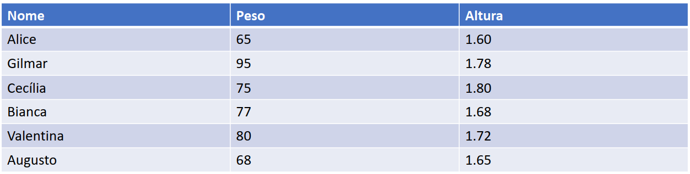

```{r set diretorio, message=FALSE, warning=FALSE, include=FALSE}
setwd("~/GitHub/R_empreendedorismo1/docs")
```

# Nivelando conhecimentos sobre R 
Para começar nosso curso, vamos aplicar operações básicas com o R. Insira os códigos e rode (ctrl + Enter em cima da linha) para ver os resultados. 
  
```{r operacoes_basicas}
# Operações básicas
5 + 5
10 - 6
10*2
5/2
#potência
5**2
# raiz quadrada
sqrt(16)
# veja que os parênteses são usados para estabelecer uma ordem de operações, 
# igual aprendemos na matemática
5*(50-45)
```
  
## Operações de atribuição 
Atribuições são muito importantes! Usamos o "<-" para atribuir o resultado de uma operação a uma variável. É como se eu estivesse falando assim: "R, realize essa operação e guarde em um objeto chamado x"
  
```{r atribuicoes}

#Atribuições
x <- 5 + 5
y <- 10 - 16
a <- 9
soma <- a + x
nome <- "daniel"
certo <- TRUE
```

## Operações básicas
Vamos fazer um programinha para calcular meu índice de massa corpórea (IMC). 
  
```{r operacoes} 
pesoDaniel <- 79
alturaDaniel <- 1.78
imcDaniel <- pesoDaniel/alturaDaniel**2
```

Agora calcule o IMC de todas as pessoas.
```{r imc, figures-side, fig.show="hold", echo=FALSE, out.height="90%", out.width="90%", fig.align='center', fig.height=3}


```

Não existe um jeito mais fácil de calcular?

## Vetores 
  
Você até pode calcular o IMC de cada um individualmente. 

Mas vou apresentar uma forma de resolver - existem várias formas, usando função, loops. Mas vamos usar um tipo de objeto chamado **vetor**. O vetor é um conjunto unidimensional de objetos de um mesmo tipo (ex.: números, palavras). 

Traduzindo... imagina uma tabela de excel formada por várias colunas. Uma das colunas é a idade e está expressa em número. Pronto, um vetor é como se fosse uma coluna com valores de um mesmo tipo.

```{r vetores}
# trabalhando com vetores. Basta colocar um c e abrir parênteses
pesos <- c(65, 95, 75, 77, 80, 68)
alturas <- c(1.60, 1.78, 1.80, 1.68, 1.72, 1.65)
imc <- pesos/alturas**2
imc
```

## Consigo arredondar os valores?
  
Consegue! Só usar a função round. 
  
```{r round, message=FALSE, warning=FALSE}

# dica, a função help serve para você pedir uma ajudinha para o R e ver o que a 
# função faz
help(round)

round(imc, 2)
imc <- round(imc, 2) #estou sobrescrevendo um vetor
                     # arredondado sobre ele mesmo
imc

```

## Matrizes 
  As **matrizes** possuem uma estrutura tabular, com linhas e colunas. Porém, semelhante ao vetor, todos os objetos devem ser de um mesmo tipo (ex.: tudo número, tudo caracter). 

```{r matriz}
Matriz<-cbind(pesos,alturas,imc)
Matriz
```

Veja que tem uma aparência de tabela. Mas daqui em diante trabalharemos com outra estrutura chamada **dataframe**. Essa estrutura tem formato tabular e ainda permite que os objetos tenham tipos diferentes, ou seja, posso ter uma coluna numérica, outra no formato data, outra no formato de caracteres e assim por diante. 

Existe um tipo de estrutura de dados chamado **lista** muito importante também. Mas entrar nele é assunto para um curso de R intermediário.  

```{r matriz2}
rownames(Matriz) <- c("Alice","Gilmar","Cecilia","Bianca","Valentina","Augusto")
Matriz
```

# Introduzindo funções para manipulação de dados

Aqui vamos começar a falar sobre manipulação de dados usando o pacote `dplyr`. É importante instalar os pacotes `dplyr` e `gapminder`, caso já não tenha feito, usando a função `install.packages("dplyr")`, assim como o pacote gapminder, que vai prover a base de dados para o curso. 

## Inspecionando o dataframe
  
```{r inspecionando, message=FALSE, warning=FALSE}
library(gapminder)
library(dplyr)
basePaises <- gapminder

# inspecionando a estrutura da base
str(basePaises)

```

```{r inspecionando2}
# inspecionando as 6 primeiras observações 
head(basePaises)

```

```{r inspecionando3}
# inspecionando as 10 últimas observações
tail(basePaises, n = 10)


```

```{r inspecionando4}
# estatísticas descritivas da base
summary(basePaises)
```

```{r inspecionando5}
# Acessando uma variável da base
head(basePaises$continent,20)
```

```{r inspecionando6, message=FALSE, warning=FALSE}
# Acessando elementos únicos
unique(basePaises$year)

# Verificando a média do vetor de expectativa de vida
mean(basePaises$lifeExp)

# A função glimpse permite dar uma olhadinha nos dados. Parece muito com a 
# função str(), mas é do pacote dplyr

glimpse(basePaises)
```

## Abrindo um parêntese 

Veja que o glimpse mostra o tipo das variáveis (int, fct, dbl). Existem vários tipos de variáveis no R e compreendê-los é importante, pois determinam possíveis visualizações e técnicas de análise. Apresentei três tipos importantes: 

* dbl (double) - valores numéricos e contínuos ("quebrados")
* int (integer) - valores numéricos discretos ("inteiros")
* fct (factor) - uma palavra. 

Se alguém a série Stranger Things, da Netflix, vai lembrar o nome dessa menininha: Eleven. Nesse caso, Eleven é um nome, portanto, representaria um factor. 


```{r eleven, figures-side, fig.show="hold", echo=FALSE, out.height="100%", out.width="100%", fig.align='center', fig.height=3}

knitr::include_graphics("imagem/eleven.png")
```

## Função filter 

Função para filtrar observações de uma base conforme algumas condições. Nesse caso, países cujo continente corresponde à Ásia. 

```{r filter, message=FALSE, warning=FALSE, paged.print=TRUE}
basePaises %>% 
  filter(continent == "Asia")

```
  
```{r filter2, message=FALSE, warning=FALSE, paged.print=TRUE}

basePaises %>%
  filter(continent == "Americas" & year>1990)

```

Nesse caso, precisamos de todas observações, com exceção do continente Oceania. Veja como fica:   

```{r filter3, message=FALSE, warning=FALSE, paged.print=TRUE}
# != diferente 
basePaises %>%
  filter(continent != "Oceania")

# Você pode armazenar sua consulta em outro objeto
baseAsia <- basePaises %>%
  filter(continent == "Asia")
```

## Função select

A função select é muito útil para você selecionar apenas as variáveis que precisa trabalhar. O PSED (base que usaremos no módulo 3) tem mais de 8000 colunas. É prudente usar a função select para separar apenas o que você precisa depois que tiver estudado os dados. 

```{r select, message=FALSE, warning=FALSE}
basePaises %>%
  select(year,country,gdpPercap)

```

Quando usamos o `-` pegamos qualquer variável menos aquela de interesse, nesse caso lifeExp. 

```{r select2, message=FALSE, warning=FALSE}

basePaises %>%
  select(-lifeExp)
```

## Função select + filter

Olha que legal, as funções conversam entre si! Então eu posso fazer dois procedimentos - filtrar e depois selecionar - em um só conjunto de comandos. 
  
```{r select_filter}
basePaises %>%
  filter(continent == "Americas" & year>1990) %>%
  select(year,country,gdpPercap)
```

## Função mutate 
  
A função mutate serve para criar uma nova variável. Nesse primeiro exemplo, criei uma variável chamada GDP (PIB), que é resultado da multiplicação entre as variáveis gdpPercap (PIB per capita) e pop (população). 

```{r mutate}
basePaises <- basePaises %>%
  mutate(GDP = gdpPercap * pop)

basePorte <- basePaises %>%
  filter(year == 1992) %>%
  mutate(porte = if_else(pop>median(pop),"G","P"))

head(basePorte)

```

## Funções group_by e summarize 

A função group_by geralmente é aplicada associada a outra função, nesse caso, vamos usar associada ao summarize.  

```{r group_by}
basePaises %>%
  group_by(country) %>%
  summarize(meanLE=mean(lifeExp),meanPop=mean(pop),meanGpc=mean(gdpPercap))

```

Veja como ela funciona: vamos agrupar todas as observações cuja variável *country* for a mesma e, em sequência, aplicar um cálculo de média sobre o agrupamento. 

<br>
```{r group_by, figures-side, fig.show="hold", echo=FALSE, out.height="100%", out.width="100%", fig.align='center', fig.height=3}

knitr::include_graphics("imagem/group_by.png")
```

Veja que posso agrupar usando mais de uma variável. Nesse caso, agrupamos todos as observações iguais de continente e ano. 

```{r group_by2}

basePaises %>%
  group_by(continent,year) %>%
  summarize(meanLE=mean(lifeExp),meanPop=mean(pop),meanGpc=mean(gdpPercap))
```

## Funções top_n e arrange
A função top_n serve para selecionar os n maiores valores que desejar. Já a arrange permite ordenar em ordem descendente ou ascedente (padrão).

```{r top_n}
basePaises %>% 
  filter(year == 2007) %>% 
  top_n(5,pop) %>% 
  arrange(desc(pop))

```

As próximas funções de manipulação são os joins, que servem para juntar duas bases. São funções importantíssimas. Vamos falar somente sobre dois tipos de joins (left_join e inner_join). Existem outros, mas esses são os que mais usamos no cotidiano. Para isso, vamos usar duas bases: o Índice de Cidades Empreendedoras (ICE), desenvolvido pela ENAP e Endeavor, e a base MUNIC do IBGE.  

## Base ICE
```{r ice, figures-side, fig.show="hold", echo=FALSE, out.height="100%", out.width="100%", fig.align='center', fig.height=3}

knitr::include_graphics("imagem/ice.png")
```

Fonte: [Índice de Cidades empreendedoras](https://ice.enap.gov.br/)

## Base MUNIC
```{r munic, figures-side, fig.show="hold", echo=FALSE, out.height="100%", out.width="100%", fig.align='center', fig.height=3}

knitr::include_graphics("imagem/munic.png")
```

Fonte: [MUNIC](https://www.ibge.gov.br/estatisticas/sociais/saude/10586-pesquisa-de-informacoes-basicas-municipais.html?=&t=o-que-e)

## Baixando as bases direto do meu github
  
```{r munic}
munic <- read.csv("https://raw.githubusercontent.com/danielppagotto/R_empreendedorismo1/main/arquivos%20de%20bases/politicas_empreendedorismo.csv",sep = ";", encoding = "UTF-8") %>% rename(cod_cidade = "X.U.FEFF.CodMun")

ice <- read.csv("https://raw.githubusercontent.com/danielppagotto/R_empreendedorismo1/main/arquivos%20de%20bases/base_ice.csv",sep = ";", encoding = "UTF-8") %>% rename(cidade = "X.U.FEFF.cidade")
```

## Inspecionando as bases

```{r inspec_munic}
glimpse(munic)
```

```{r inspec_ice}
glimpse(ice)
```

Vamos juntar as bases por meio das colunsa cod_cidade e cod_ibge. 

Um ponto **muito importante**: ambas variáveis devem ser do mesmo tipo. No caso, ambas estão como `int`. Caso uma fosse factor e a outra `int`, o join geraria uma mensagem de erro. 

Vamos supor que o cod_ibge da base ice estive em formato fct (factor, lembra da Eleven do Stranger Things). Para transformá-lo para o formato int seria necessário aplicar o seguinte comando. 

```{r transformando int}
ice$cod_ibge <- as.integer(ice$cod_ibge)
```


## inner_join 

```{r inner, figures-side, fig.show="hold", echo=FALSE, out.height="100%", out.width="100%", fig.align='center', fig.height=3}

knitr::include_graphics("imagem/inner_join.png")
```

```{r}
inner <- munic %>% 
  inner_join(ice, by = c("cod_cidade"="cod_ibge"))
```

## left_join

```{r left, figures-side, fig.show="hold", echo=FALSE, out.height="100%", out.width="100%", fig.align='center', fig.height=3}

knitr::include_graphics("imagem/left_join.png")
```

```{r}
left <- munic %>% 
  left_join(ice, by = c("cod_cidade"="cod_ibge"))
```

# Introduzindo funções para visualização de dados

## Dica de leitura 
  
```{r livro, figures-side, fig.show="hold", echo=FALSE, out.height="30%", out.width="40%", fig.align='center', fig.height=3}

knitr::include_graphics("imagem/storytelling.jpg")

```

## Preparando nosso ambiente
  
Antes de começar, vamos chamar alguns pacotes e preparar uma base que usaremos! Caso ainda não tenha algum dos pacotes abaixo, terá que instalar usando o comando `install.packages("nome do pacote")`.

```{r inicializar, echo=TRUE, message=FALSE, warning=FALSE}
library(ggplot2)
library(dplyr)
library(gapminder)

base <- gapminder %>% 
  filter(year == 2007) 

glimpse(base)
```


## GGPlot2 - a base de tudo
O R por si só possui funções para gerar gráficos, porém o ggplot2 é um pacote que fornece um conjunto bem extenso de possibilidades 

```{r histograma1, echo=TRUE, message=FALSE, warning=FALSE,fig.align='center', fig.height=6, fig.width=6}

hist(base$lifeExp)

```

Vamos criar um histograma sobre a variável expectativa de vida. 

```{r histograma2, echo=TRUE, message=FALSE, warning=FALSE,fig.align='center', fig.height=6, fig.width=6}

ggplot(base, aes(x = lifeExp)) + geom_histogram()

```

## Densidade
Vamos criar um gráfico de densidade sobre a variável expectativa de vida. Veja outra forma de usar a função ggplot. 

```{r densidade, echo=TRUE, message=FALSE, warning=FALSE,fig.align='center', fig.height=6, fig.width=6}

base %>% 
  ggplot(aes(x = lifeExp)) + geom_density()

```

## Boxplot
  
Vamos criar um boxplot sobre a variável expectativa de vida. 

```{r boxplot1, echo=TRUE, message=FALSE, warning=FALSE,fig.align='center', fig.height=6, fig.width=6}

base %>% 
  ggplot(aes(y = lifeExp)) + geom_boxplot()

```

Vamos criar outro boxplot sobre a variável expectativa de vida. 

```{r boxplot2, echo=TRUE, message=FALSE, warning=FALSE,fig.align='center', fig.height=6, fig.width=6}

base %>% 
  ggplot(aes(x = continent, y = lifeExp)) + geom_boxplot()

```

## Gráfico de colunas 
  
Vamos criar um gráfico de barras da variável expectativa de vida. Nesse caso, vamos manter os 10 países da Ásia com maior taxa de expectativa de vida. 

```{r barras, echo=TRUE, message=FALSE, warning=FALSE,fig.align='center', fig.height=5, fig.width=4}
base %>% 
  filter(continent == "Asia") %>% 
  top_n(n = 10, wt = lifeExp) %>% 
  ggplot(aes(x = country, y = lifeExp)) + geom_col() 
```

## Coord_flip
  
Veja como melhorar a visualização com um simples argumento:

```{r barras2, echo=TRUE, message=FALSE, warning=FALSE,fig.align='center', fig.height=5, fig.width=4}
base %>% 
  filter(continent == "Asia") %>% 
  top_n(n = 10, wt = lifeExp) %>% 
  ggplot(aes(x = country, y = lifeExp)) + geom_col() + coord_flip()
```

## Mas consigo deixar em ordem?
Sim, para isso, vamos usar uma função do pacote forcats.

```{r barras3, echo=TRUE, message=FALSE, warning=FALSE,fig.align='center', fig.height=4, fig.width=6}
library(forcats)
base %>% 
  filter(continent == "Asia") %>% 
  top_n(n = 10, wt = lifeExp) %>% 
  ggplot(aes(x = fct_reorder(country,lifeExp), y = lifeExp)) + geom_col() + coord_flip()
```

## Labels
Adicionando labels 

```{r barras4, echo=TRUE, message=FALSE, warning=FALSE,fig.align='center', fig.height=5, fig.width=4}
base %>% 
  filter(continent == "Asia") %>% 
  top_n(n = 10, wt = lifeExp) %>% 
  ggplot(aes(x = fct_reorder(country,lifeExp), y = lifeExp)) + geom_col() + 
  geom_label(aes(label=round(lifeExp))) +  coord_flip()
```

## Linhas
Para fazer esse gráfico, vamos usar a base original, gapminder, e filtrar apenas o Brasil. 

```{r linhas, echo=TRUE, message=FALSE, warning=FALSE,fig.align='center', fig.height=5, fig.width=6}
gapminder %>% 
  filter(country == "Brazil") %>% 
  ggplot(aes(x = year, y = lifeExp)) + geom_line() 
```

## Argumento col
Veja que legal é o argumento col dentro do `aes`! Nesse caso pegamos Brasil e Argentina. Olha como estamos filtrando... Primeiro criamos um vetor com o nome dos países e depois aplicamos o filter usando o `%in`.

```{r linhas2, echo=TRUE, message=FALSE, warning=FALSE,fig.align='center', fig.height=5, fig.width=6}
paises <- c("Brazil","Argentina")
gapminder %>% 
  filter(country %in% paises) %>% 
  ggplot(aes(x = year, y = lifeExp, col = country)) + geom_line() 
```

## Usando argumento fill 
Vamos ver como funciona o argumento `fill`.

```{r densidade_customizada2, echo=TRUE, fig.align='center', fig.height=5.5, fig.width=6.5, message=FALSE, warning=FALSE}
base %>% 
  top_n(10) %>% 
  ggplot(aes(x = fct_reorder(country,gdpPercap), y=gdpPercap, fill = continent)) + geom_col() + coord_flip()
```

## Podemos customizar mais elementos? 

```{r densidade customizada, echo=TRUE, fig.align='center', fig.height=5.5, fig.width=5.5, message=FALSE, warning=FALSE}
ggplot(base,aes(x=lifeExp)) + geom_density(fill="darkblue") +
  labs(title = "Histograma da expectativa de vida", 
       x = "Expectativa de vida", y = "Frequência") + theme_minimal()
```

Dá para customizar uma muitos outros elementos: cores de fundo, de linhas, tamanho de letras, posição da legenda e assim por diante. 

## Vamos trabalhar com duas variáveis 
Vamos relacionar duas variáveis: PIB per capita e expectativa de vida 

```{r scatter, echo=TRUE, fig.align='center', fig.height=5.5, fig.width=6.5, message=FALSE, warning=FALSE}
ggplot(base,aes(x=log(gdpPercap),y=lifeExp)) + geom_point() +
  labs(x = "PIB per capita (log)", y = "Expectativa de vida") + theme_bw()
```

## Mais uma camada
  
```{r scatter2, echo=TRUE, fig.align='center', fig.height=5.5, fig.width=5.5, message=FALSE, warning=FALSE}
ggplot(base,aes(y=lifeExp, x=log(gdpPercap))) + geom_point() +
  geom_smooth(method = "lm", se=FALSE) + 
  labs(x = "PIB per capita (log)",
       y = "Expectativa de vida") + theme_bw()
```

## Argumento col 
  
```{r scatter3, echo=TRUE, fig.align='center', fig.height=5.5, fig.width=5.5, message=FALSE, warning=FALSE}
ggplot(base,aes(y=lifeExp, x=log(gdpPercap), col=continent)) + geom_point() +
  geom_smooth(method = "lm", se=FALSE) + 
  labs(x = "PIB per capita (log)",
       y = "Expectativa de vida") + theme_bw()
```

## Argumento size
  
```{r scatter4, echo=TRUE, fig.align='center', fig.height=5.5, fig.width=5.5, message=FALSE, warning=FALSE}
ggplot(base,aes(y=lifeExp, x=log(gdpPercap), col=continent,size = pop)) + geom_point() +
  geom_smooth(method = "lm", se=FALSE) + 
  labs(x = "PIB per capta (log)",
       y = "Expectativa de vida") + theme_bw()
```

## Facet 
  
```{r scatter5, echo=TRUE, fig.align='center', fig.height=5.5, fig.width=8, message=FALSE, warning=FALSE}
ggplot(base,aes(x=log(gdpPercap), y=lifeExp, col=continent,
                size = pop)) + geom_point() + geom_smooth(method = "lm", se=FALSE) + 
  labs(x = "PIB per capita (log)", y = "Expectativa de vida") + theme_bw() + 
  facet_grid(~continent)
```

## Criando gráficos com Esquisse 

O esquisse permite visualizar gráficos no estilo ggplot2 usando point n' click. É uma ótima ferramenta para "estudar" o ggplot2.  


```{r esquise, message=FALSE, warning=FALSE, eval = FALSE}
library(esquisse)

esquisser(viewer = "browser")
```


```{r imagem_esquisse, figures-side, fig.show="hold", echo=FALSE, out.height="70%", out.width="90%", fig.align='center', fig.height=3}


knitr::include_graphics("imagem/esquisse.png")
```

## Gerando gráficos interativos 
  
Vamos resgatar um gráfico que fizemos lá atrás.

```{r plotly2, echo=TRUE, message=FALSE, fig.height=4, fig.width=5.5, warning=FALSE, fig.align='center'}
library(plotly)
grafico <- ggplot(base,aes(y=lifeExp, x=log(gdpPercap), col=continent)) + geom_point() +
  labs(x = "PIB per capita (log)",
       y = "Expectativa de vida") + theme_bw()
ggplotly(grafico)
```

# Para aprender mais

Ao clicar será direcionad@ para a página indicada

- [GGPlot2 cheat sheet](https://rstudio.com/wp-content/uploads/2015/03/ggplot2-cheatsheet.pdf)
- [GGPlot2 - LAPEI](https://www.youtube.com/watch?v=IPyjHKe30eo)
- [Plotly](https://plotly.com/)
- [Blog Datanovia](https://www.datanovia.com/en/blog/gganimate-how-to-create-plots-with-beautiful-animation-in-r/)
- [Datavis with R](https://rkabacoff.github.io/datavis/Interactive.html)
- [Live Curso-R sobre extensões do ggplot2](https://www.youtube.com/watch?v=LXZhvWE2ne8&t=7267s)
- [The R graph gallery](https://www.r-graph-gallery.com/)
- [Documentação dplyr](https://cloud.r-project.org/web/packages/dplyr/dplyr.pdf)
- [Documentação ggplot2](https://cloud.r-project.org/web/packages/ggplot2/ggplot2.pdf)

# Obrigado
## Se encontrou algum erro ou tem alguma sugestão de melhoria pode entrar em contato. Se foi útil também avise! Ah... e pode passar adiante. Quanto mais gente tendo acesso a esse conhecimento melhor! 

**Daniel Pagotto** | danielppagotto@gmail.com | [LinkedIn](https://www.linkedin.com/in/daniel-do-prado-pagotto-bab62a50/)

[LAPEI - UFG](https://lapei.face.ufg.br/) | lapeiufg@gmail.com. | No instagram: [lapeiufg](https://www.instagram.com/lapeiufg/)
