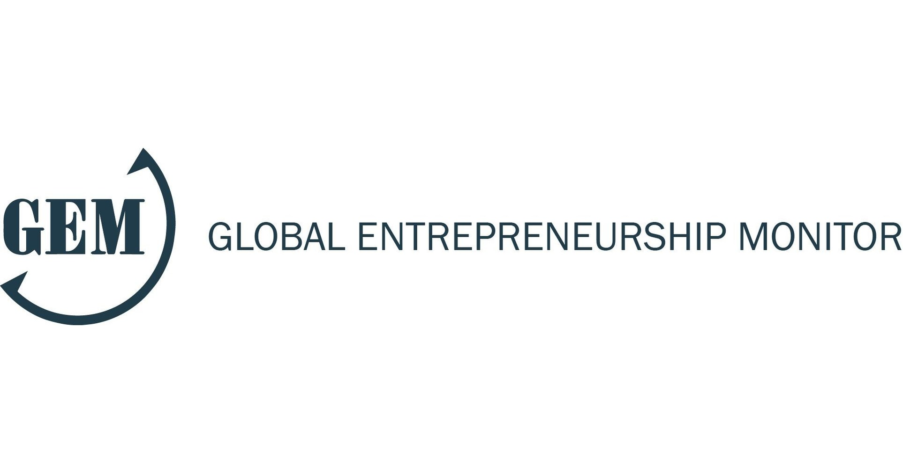
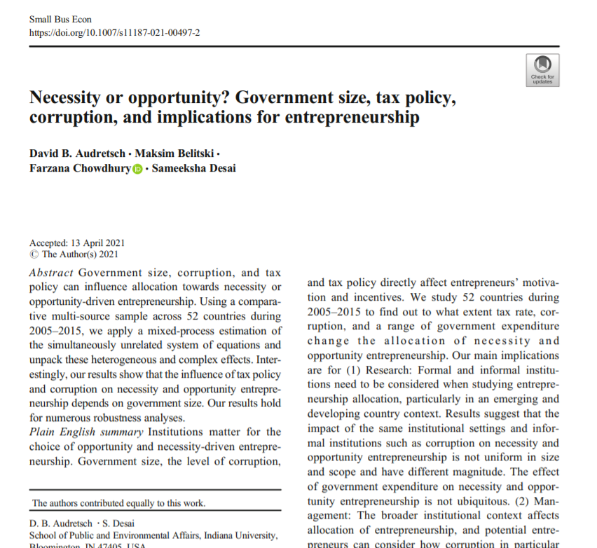
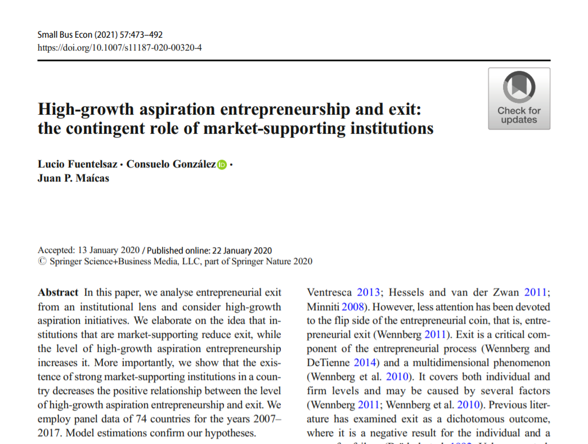
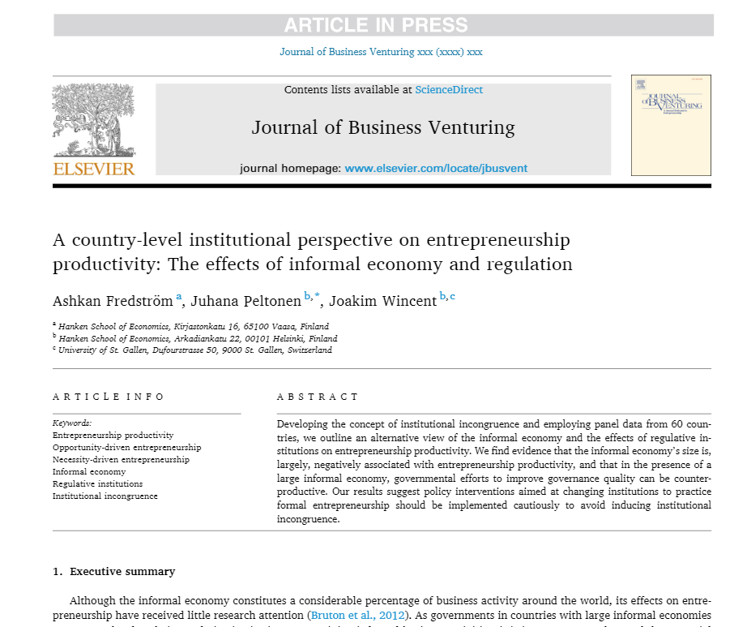
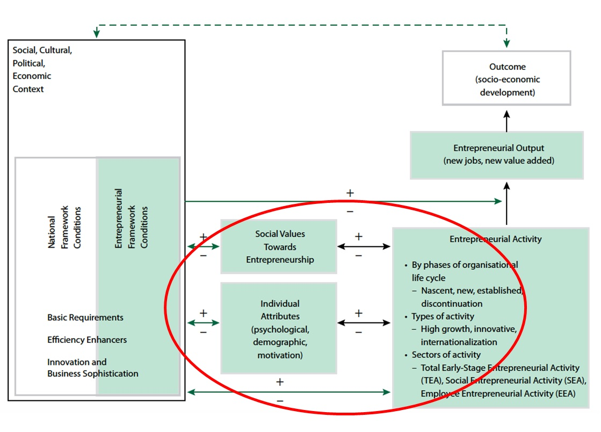
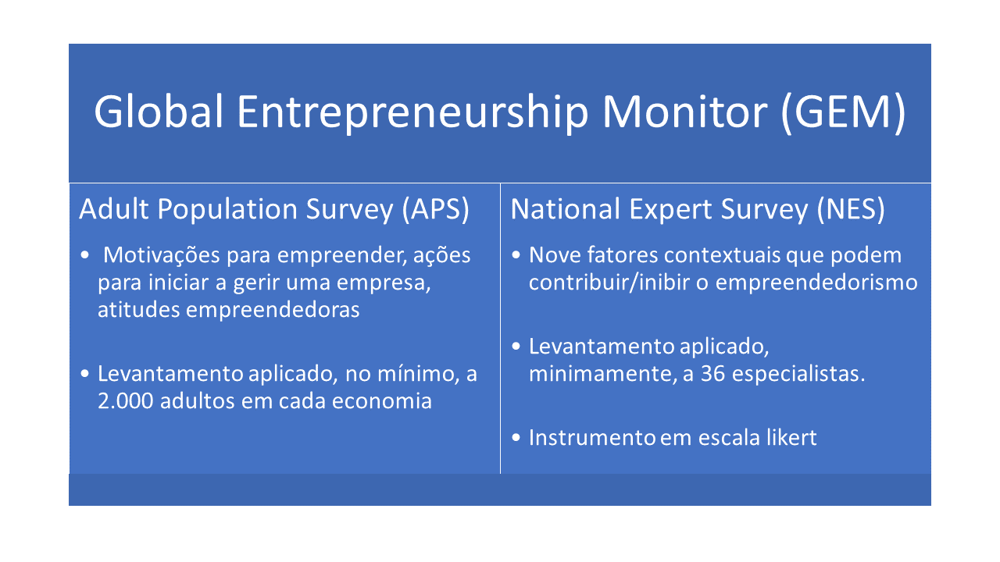

```{r set diretorio, message=FALSE, warning=FALSE, include=FALSE}
library(DT)
 setwd("~/GitHub/R_empreendedorismo2")
```

# Agradecimentos
<br>
```{r agradecimentos, figures-side, fig.show="hold", echo=FALSE, out.height="100%", out.width="100%", fig.align='center', fig.height=4, fig.cap=" "}

knitr::include_graphics("imagem/realizacao.png")

```


class: inverse, middle, left
# Divisão do curso 
* **Módulo 1: conceitos básicos de R** 
  + Cálculos básicos
  + Tipos de variáveis e objetos
  + O pacote dplyr para manipulação de dataframes
  + O pacote ggplot2 para visualização de dados
* **Módulo 2: usando o R para explorar o Global Entrepreneurship Monitor (GEM)**
  + Compreendedo as bases 
  + Tratando as bases 
  + Análise Exploratória dos Dados do GEM
* **Módulo 3: usando o R para explorar o Panel Study of Entrepreneurial Dynamics (PSED)**
  + Compreendendo a base
  + Tratando a base 
  + Análise Exploratória dos Dados do PSED

---
class: inverse, middle, left
# Objetivos do módulo 1
- Demonstrar relevância do GEM
- Explorar variáveis disponíveis no GEM 
- Aplicar funções para manipular dataframes 
- Aplicar análise exploratória dos dados

---
# Global  Entrepreneurship Monitor 

#### - O [GEM](https://www.gemconsortium.org/) foi criado em 1999 como um projeto conjunto entre a Babson College e a London Business School

#### - Pesquisas focam em atitudes/comportamento empreendedor bem como ecossistemas de empreendedorismo

#### - Levantamentos são realizados com empreendedores e especialistas 

#### - Divulgação de relatórios anuais sobre o empreendedorismo pelo mundo, por cada país e relatórios temáticos (ex.: [Impactos da Covid-19 no empreendedorismo](https://www.gemconsortium.org/reports/covid-impact-report))
<br>
```{r r_spss, figures-side, fig.show="hold", echo=FALSE, out.height="100%", out.width="100%", fig.align='center', fig.height=3}


```
---
# GEM e pesquisas

```{r artigo_gem1, figures-side, fig.show="hold", echo=FALSE, out.height="90%", out.width="90%", fig.align='center', fig.height=3}


```
---
# GEM e pesquisas

```{r artigo_gem2, figures-side, fig.show="hold", echo=FALSE, out.height="90%", out.width="90%", fig.align='center', fig.height=3}


```
---
# GEM e pesquisas

```{r artigo_gem3, figures-side, fig.show="hold", echo=FALSE, out.height="90%", out.width="90%", fig.align='center', fig.height=3}


```

---
# Framework GEM

```{r gem_framework, figures-side, fig.show="hold", echo=FALSE, out.height="85%", out.width="85%", fig.align='center', fig.height=3}


```

fonte: [Base de conhecimento - framework](http://gem-consortium.ns-client.xyz/wiki/1148)

---
# Bases do GEM

```{r linguagens, figures-side, fig.show="hold", echo=FALSE, out.height="100%", out.width="100%", fig.align='center', fig.height=3, fig.cap=" "}


```

fonte: [Base de conhecimento do GEM](http://gem-consortium.ns-client.xyz/about/wiki)

---


---
class: inverse, middle, center

# Obrigado

**Daniel Pagotto** | danielppagotto@gmail.com | [LinkedIn](https://www.linkedin.com/in/daniel-do-prado-pagotto-bab62a50/)


