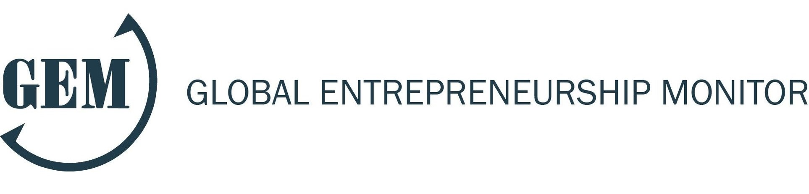

```{r set diretorio, message=FALSE, warning=FALSE, include=FALSE}
library(DT)
 setwd("~/GitHub/R_empreendedorismo2")
```

# Agradecimentos
<br>
```{r agradecimentos, figures-side, fig.show="hold", echo=FALSE, out.height="100%", out.width="100%", fig.align='center', fig.height=4, fig.cap=" "}

knitr::include_graphics("imagem/realizacao.png")

```


class: inverse, middle, left
# Divisão do curso 
* **Módulo 1: conceitos básicos de R** 
  + Cálculos básicos
  + Tipos de variáveis e objetos
  + O pacote dplyr para manipulação de dataframes
  + O pacote ggplot2 para visualização de dados
* **Módulo 2: usando o R para explorar o Global Entrepreneurship Monitor (GEM)**
  + Compreendedo as bases 
  + Tratando as bases 
  + Análise Exploratória dos Dados do GEM
* **Módulo 3: usando o R para explorar o Panel Study of Entrepreneurial Dynamics (PSED)**
  + Compreendendo a base
  + Tratando a base 
  + Análise Exploratória dos Dados do PSED

---
class: inverse, middle, left
# Objetivos do módulo 2
- Demonstrar relevância do GEM
- Explorar variáveis disponíveis no GEM 
- Aplicar funções para manipular dataframes 
- Aplicar análise exploratória dos dados

---
# Global  Entrepreneurship Monitor 

#### - O [GEM](https://www.gemconsortium.org/) foi criado em 1999 como um projeto conjunto entre a Babson College e a London Business School

#### - Pesquisas focam em atitudes/comportamento empreendedor bem como ecossistemas de empreendedorismo

#### - Levantamentos são realizados com empreendedores e especialistas 

#### - Divulgação de relatórios anuais sobre o empreendedorismo pelo mundo, por cada país e relatórios temáticos (ex.: [Impactos da Covid-19 no empreendedorismo](https://www.gemconsortium.org/reports/covid-impact-report))
<br>
```{r gem_logo, figures-side, fig.show="hold", echo=FALSE, out.height="100%", out.width="100%", fig.align='center', fig.height=3}


```

---
# Global  Entrepreneurship Monitor 

#### - Os microdados do GEM ficam disponíveis após três anos. Porém, no [site](http://gem-consortium.ns-client.xyz/data) é possível acessá-los 

#### - Para esse curso serão apresentados dados consolidados por países, disponível também no site 

#### - Tratar os microdados exigiria mais tempo e nivelamento em estatística para trabalhar com bases de amostragem complexa


<br>
```{r gem_logo2, figures-side, fig.show="hold", echo=FALSE, out.height="100%", out.width="100%", fig.align='center', fig.height=3}


```

---
# GEM e pesquisas

```{r artigo_gem1, figures-side, fig.show="hold", echo=FALSE, out.height="90%", out.width="90%", fig.align='center', fig.height=3}

knitr::include_graphics("imagem/artigo_gem1.png")
```
---
# GEM e pesquisas

```{r artigo_gem2, figures-side, fig.show="hold", echo=FALSE, out.height="90%", out.width="90%", fig.align='center', fig.height=3}

knitr::include_graphics("imagem/artigo_gem2.png")
```
---
# GEM e pesquisas

```{r artigo_gem3, figures-side, fig.show="hold", echo=FALSE, out.height="90%", out.width="90%", fig.align='center', fig.height=3}

knitr::include_graphics("imagem/artigo_gem3.png")
```

---
# Framework GEM

```{r gem_framework, figures-side, fig.show="hold", echo=FALSE, out.height="85%", out.width="85%", fig.align='center', fig.height=3}


```

fonte: [Base de conhecimento - framework](http://gem-consortium.ns-client.xyz/wiki/1148)

---
# Bases do GEM

```{r linguagens, figures-side, fig.show="hold", echo=FALSE, out.height="100%", out.width="100%", fig.align='center', fig.height=3, fig.cap=" "}

knitr::include_graphics("imagem/gem_bases.png")
```

fonte: [Base de conhecimento do GEM](http://gem-consortium.ns-client.xyz/about/wiki)

---
# Base de especialistas
A base de especialistas do GEM contempla diferentes dimensões: 

* **Finanças empreendedoras**: disponibilidade de diferentes fontes de finanças para pequenas e médias empresas (PMEs)
* **Políticas governamentais**: o quanto as políticas públicas contribuem para o empreendedorismo
  + O quanto empreendedorismo é importante como uma política de governo
  + O quanto impostos e burocracia afetam empreendedorismo
* **Programas governamentais para empreendedorismo**: presença de programas governamentais para empreendedorismo 
* **Educação empreendedora**: presença de treinamentos sobre criação e gerenciamento de PMEs em diferentes graus de ensino
  + Nível básico 
  + Nível Superior
* **Transferência de Pesquisa & Desenvolvimento (P&D)**: o quanto que pesquisas nacionais conduzem a criação de oportunidades comerciais e estão disponíveis para PMEs

---
# Base de especialistas 

* **Infraestrutura legal e comercial**: presença de serviços e instituições que fornecem suporte a PMEs 
* **Regulação de entrada**: que é dividido em a) dinamismo de mercado - o quanto que o mercado muda de ano a ano; b) abertura de mercado - o quanto novas empresas são livres para entrar em mercados existentes 
* **Infraestrutura física**: facilidade de acessar recursos físicos (ex.: comunicação, logística, espaço físico)
* **Cultura e normas sociais**: o quanto normas sociais e culturais encorajam novos métodos de negócios que podem gerar riqueza e renda de uma pessoa 

Vamos começar lendo a base a partir do meu repositório do github: 

```{r lendo_nes, message=FALSE, warning=FALSE}
library(readr); library(dplyr); library(skimr)
library(ggplot2); library(ggrepel); library(directlabels)
library(GGally)

gem_especialistas <- read_delim("https://raw.githubusercontent.com/danielppagotto/R_empreendedorismo2/main/arquivos%20de%20bases/gem_nes_historico.csv", ";", escape_double = FALSE, trim_ws = TRUE)

```
---
# Explorando a base 

```{r glimpse}
# Vamos usar o glimpse para conferir a base 
glimpse(gem_especialistas)
```
---
# Explorando base de especialistas
Vamos baixar a base e comparar alguns países: Brasil, Chile, Colômbia e México. 

Além disso, vamos separar algumas variáveis de interesse: `economy`, `year`, `gov_support`, `taxes_bureaucracy`, `gov_programs`, `internal_market_dynamics`.
<br>

```{r filte_gem, message=FALSE, warning=FALSE, echo=TRUE, results='hide'}

paises <- c("Brazil","Chile","Colombia","Mexico")


gem_paises_selecionados <- gem_especialistas %>% 
                              filter(economy %in% paises) %>% 
                              select(economy, year, gov_support, taxes_bureaucracy, 
                                     gov_programs, internal_market_dynamics)

# Estatísticas descritivas
gem_paises_selecionados %>%
  select(-year) %>% 
  group_by(economy) %>% 
  skim() 

```
---
# Plotando variáveis 

Vamos investigar a variável `gov_support` dos países ao longo do tempo. 

```{r ggplot0, fig.height=5,fig.width=10, fig.align='center'}

gem_paises_selecionados %>% 
  ggplot(aes(year,gov_support)) + geom_line() 

```
---
# Adicionando o parâmetro col 
Vamos ainda adicionar destacar mais a linha e retirar esse fundo cinza
```{r ggplot1, fig.height=5,fig.width=10, fig.align='center'}

gem_paises_selecionados %>% 
  ggplot(aes(year,gov_support, col = economy)) + geom_line(size = 2) +
  theme_minimal()
```
---
# Adicionando títulos

```{r ggplot2, fig.height=5,fig.width=10, fig.align='center'}

gem_paises_selecionados %>% 
  ggplot(aes(year,gov_support, col = economy)) + geom_line(size = 2) +
  theme_minimal() + xlab("Ano") + ylab("Suporte Governamental") +
  ggtitle("Suporte Governamental", "Comparação entre Brasil, Chile, Colombia e México - Dados GEM")
```
---
# Função geom_dl() 

```{r ggplot3, fig.height=5, fig.width=10, fig.align='center'}

gem_paises_selecionados %>% 
  ggplot(aes(year,gov_support, col = economy)) + geom_line(size = 2) +
  geom_dl(aes(label = economy), method = list(dl.combine("first.points", "last.points"))) +
  theme_minimal() + xlab("Ano") + ylab("Suporte Governamental") +
  ggtitle("Suporte Governamental", "Comparação entre Brasil, Chile, Colombia e México - Dados GEM")
```

---
# Aumentando fontes
Vamos aumentar as fontes e retirar a legenda
```{r ggplot4, fig.height=4,fig.width=10, fig.align='center'}

gem_paises_selecionados %>% 
  ggplot(aes(year,gov_support, col = economy)) + geom_line(size = 2) +
  geom_dl(aes(label = economy), method = list(dl.combine("first.points", "last.points"))) +
  theme_minimal() + xlab("Ano") + ylab("Suporte Governamental") + theme(legend.position = "none") +
  theme(plot.title = element_text(size=22)) + theme(axis.title.y = element_text(size = rel(1.2), angle = 90)) + theme(axis.title.x = element_text(size = rel(1.2), angle = 0)) + ggtitle("Suporte Governamental", "Comparação entre Brasil, Chile, Colombia e México - Dados GEM")

```

---
# Aumentando fontes
Vamos aumentar as fontes e retirar a legenda
```{r ggplot5, fig.height=4,fig.width=10, fig.align='center'}

gem_paises_selecionados %>% 
  ggplot(aes(year,gov_support, col = economy)) + geom_line(size = 2) +
  geom_dl(aes(label = economy), method = list(dl.combine("first.points", "last.points"))) +
  theme_minimal() + xlab("Ano") + ylab("Suporte Governamental") + theme(legend.position = "none") +
  theme(plot.title = element_text(size=22)) + theme(axis.title.y = element_text(size = rel(1.2), angle = 90)) + theme(axis.title.x = element_text(size = rel(1.2), angle = 0)) + ggtitle("Suporte Governamental", "Comparação entre Brasil, Chile, Colombia e México - Dados GEM") +
scale_x_continuous(breaks = seq(2010,2020,1)) 

```

---
# Explorando dados de APS


---
class: inverse, middle, center

# Obrigado

**Daniel Pagotto** | danielppagotto@gmail.com | [LinkedIn](https://www.linkedin.com/in/daniel-do-prado-pagotto-bab62a50/)


